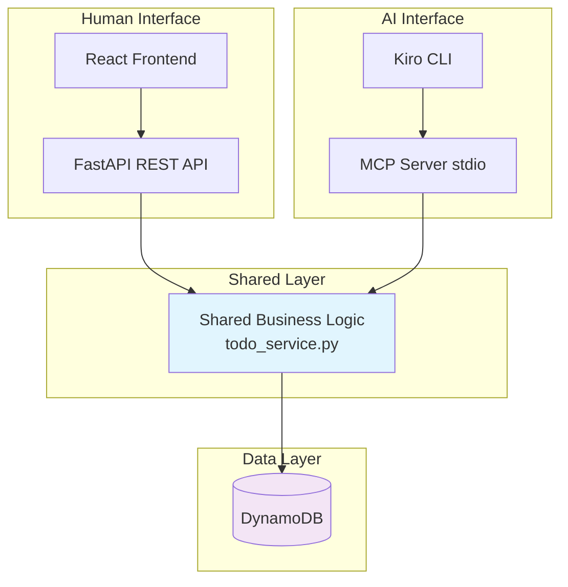

# MCP Test Stack

A complete testing environment that demonstrates how to build MCP servers alongside traditional web applications using shared business logic and AWS Well-Architected principles.

## What This Demonstrates

This project showcases a **dual-interface architecture** where the same business logic powers both:
- **Traditional Web App**: React frontend + FastAPI REST API
- **AI Integration**: MCP server for Kiro CLI and other AI tools

Both interfaces access the same DynamoDB database directly, demonstrating how to build AI-ready applications without architectural compromises.

## Key Innovation

Instead of building separate systems for humans and AI, this stack shows how to:
- Share business logic between REST APIs and MCP servers
- Maintain loose coupling with direct database access
- Scale each interface independently
- Avoid cascading failures between services



**Key Principles**:
- Loose coupling: Services access DynamoDB directly
- Shared code: Common business logic in `shared/` module
- Independent scaling: Each service can scale separately
- No cascading failures: Services don't depend on each other

## Stack

- **Backend API**: FastAPI + Python 3.11
- **MCP Server**: Python MCP SDK (stdio transport)
- **Frontend**: React 19 + TypeScript + Vite + Tailwind CSS
- **Database**: DynamoDB Local
- **Shared Logic**: Python module used by both services
- **Testing**: Vitest
- **Orchestration**: Docker Compose

## Quick Start

```bash
# One command to start everything
make start

# Or step by step:
make build
make up
make init-db
```

## Services

- Frontend: http://localhost:5173
- Backend API: http://localhost:8002
- DynamoDB Admin: http://localhost:8001
- DynamoDB Local: http://localhost:8000
- MCP Server: stdio (connect via Kiro)

## Usage

### Manual Testing (Frontend)
Visit http://localhost:5173 to create, update, and delete todos via the web UI.

### AI Testing (Kiro + MCP)

Add to your Kiro config (`~/.config/kiro/mcp_config.json`):
```json
{
  "mcpServers": {
    "todo-server": {
      "command": "docker",
      "args": ["exec", "-i", "mcp-server", "python", "server.py"]
    }
  }
}
```

Then use Kiro to interact with todos:
- "Create a todo: Buy groceries"
- "List all todos"
- "Mark todo X as completed"

### Development

**Add new features**:
1. Update `shared/todo_service.py` with business logic
2. Add REST endpoint in `backend/main.py`
3. Add MCP tool in `mcp-server/server.py`
4. Both services use the same shared logic

**Run tests**:
```bash
make test
```

## Project Structure

```
mcp-test-stack/
├── shared/              # Shared business logic
│   ├── db.py           # DynamoDB client
│   ├── todo_service.py # Todo operations
│   └── init_db.py      # Table initialization
├── backend/            # FastAPI REST API
├── mcp-server/         # MCP server for Kiro
├── frontend/           # React app
├── docker-compose.yml
├── Makefile
└── mcp-config.json     # Kiro MCP configuration
```

## AWS Deployment

This architecture maps directly to AWS services:

- **DynamoDB Local** → **DynamoDB**
- **FastAPI** → **Lambda + API Gateway** or **ECS/Fargate**
- **MCP Server** → **Lambda** or **ECS Task**
- **Frontend** → **S3 + CloudFront** or **Amplify**
- **Shared Logic** → **Lambda Layer** or **shared package**

All services maintain direct DynamoDB access with no inter-service dependencies.
